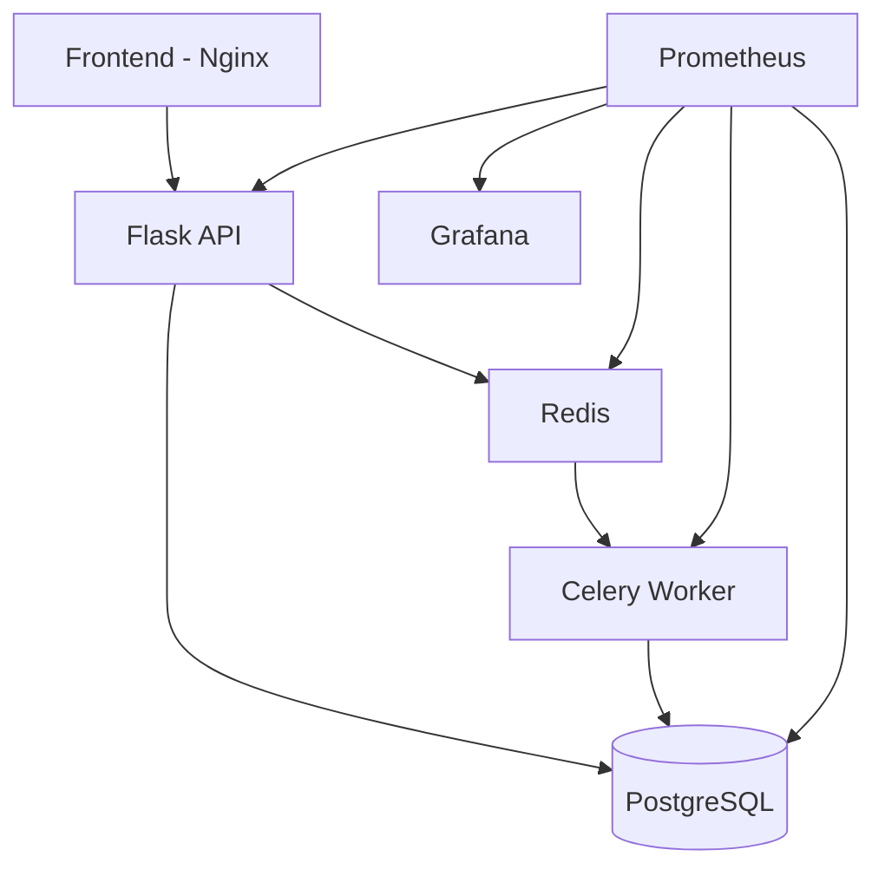

# Personal Maintenance Tracker

## Overview

Full-stack application used to explore DevOps concepts across backend, workers, containers, Kubernetes, and monitoring.

## System Flow


---

## Tech Stack

- Python (Flask)
- PostgreSQL
- Redis
- Celery
- Docker & Docker Compose
- Kubernetes (Helm)
- Terraform (EC2)
- Prometheus & Grafana
- Bash (system + docker scripts)

---

## Key Features

- Task and asset management via REST API
- Background job processing with Celery workers
- Redis used as message broker
- PostgreSQL for persistent storage
- Frontend served via Nginx
- Metrics exposed for Prometheus
- Grafana dashboards for visualization
- Kubernetes deployment via Helm
- Terraform configuration for cloud infrastructure
- System and Docker monitoring scripts (CPU, disk, containers)

---

## Architecture

- Frontend  
  Static UI served by Nginx

- API (Flask)  
  Handles requests, stores data, triggers jobs

- Worker (Celery)  
  Processes background tasks

- Redis  
  Message queue between API and worker

- PostgreSQL  
  Stores assets, tasks, job results

- Monitoring  
  Prometheus scrapes metrics  
  Grafana visualizes them

---

## Deployment Modes

### Docker (local)
```bash
docker compose up --build
```
---

### Kubernetes / Helm

Deployment is managed via Helm.
```bash
helm upgrade --install maintenance-tracker ./helm/maintenance-tracker
```
Legacy Kubernetes manifests are kept for reference:
```bash
backups/stage9-legacy-k8s/k8s/
```
---

## Lessons Learned

- Difference between synchronous API and async workers
- Handling state (PostgreSQL) in containerized environments
- Debugging multi-container setups (API + Redis + worker)
- Kubernetes resource wiring (Services, ConfigMaps, Secrets)
- Observability basics (metrics, dashboards)
- Tradeoffs between Docker Compose and Kubernetes
- Writing and using operational scripts

---

## Status

Working system covering:

- API
- Worker queue
- Database
- Frontend
- Monitoring
- Kubernetes deployment via Helm

Some parts are still rough (structure, consistency), but all components are functional and tested locally and in Kubernetes.
